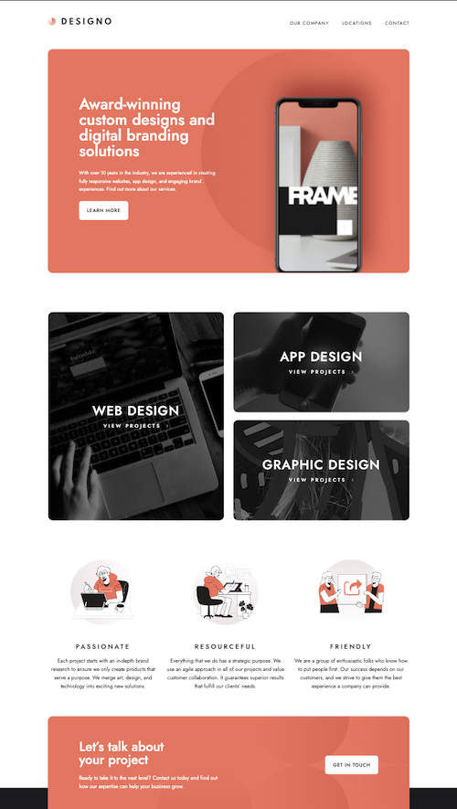
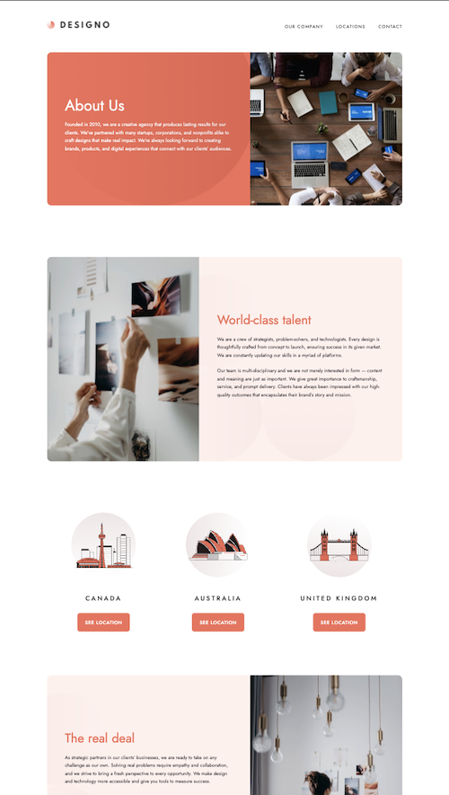
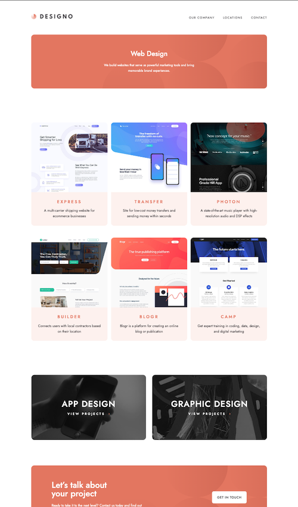
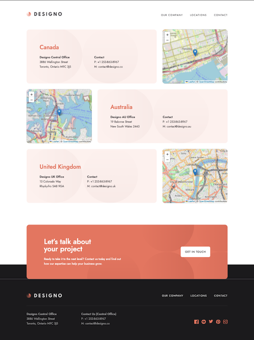
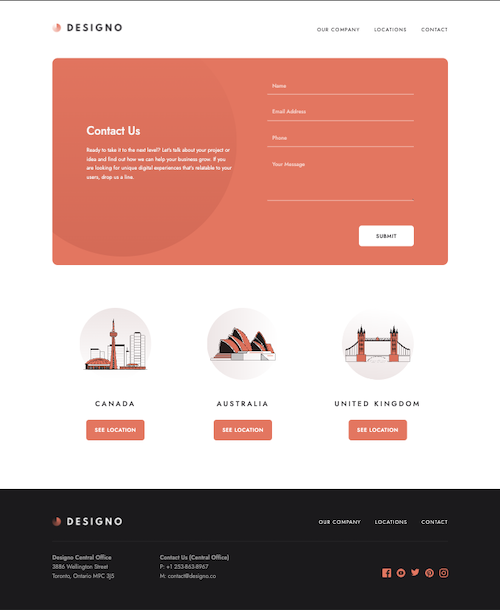

# Designo agency website

This is a solution to the [Designo agency website challenge on Frontend Mentor](https://www.frontendmentor.io/challenges/designo-multipage-website-G48K6rfUT). Front-end mentor challenges provide you with a design file which you are tasked to build out into a functional website.

## Table of contents

- [Installation](#installation)
- [The challenge](#the-challenge)
- [Screenshot](#screenshot)
- [Links](#links)
- [Built with](#built-with)

## Overview

### Installation

1. Clone this repository:

```
  https://github.com/brodiehunt/designo-studio.git
```

2. Install the dependancies

```
  npm install
```

3. Run the application

```
  npm run dev
```

### The challenge

Users should be able to:

- View the optimal layout for each page depending on their device's screen size
- See hover states for all interactive elements throughout the site
- Receive an error message when the contact form is submitted if:
  - The `Name`, `Email Address` or `Your Message` fields are empty should show "Can't be empty"
  - The `Email Address` is not formatted correctly should show "Please use a valid email address"
- **Bonus**: View actual locations on the locations page maps (we recommend [Leaflet JS](https://leafletjs.com/) for this)

### Screenshot







### Links

- Github URL: [Code here](https://github.com/brodiehunt/designo-studio)
- Live Site URL: [Designo Studio](https://brodie-designo-studios.netlify.app/)

### Built with

- leafletJS - integrated maps
- framer motion
- Mobile-first workflow
- [React](https://reactjs.org/) - JS library
- React router
- [Styled Components](https://styled-components.com/) - For styles
